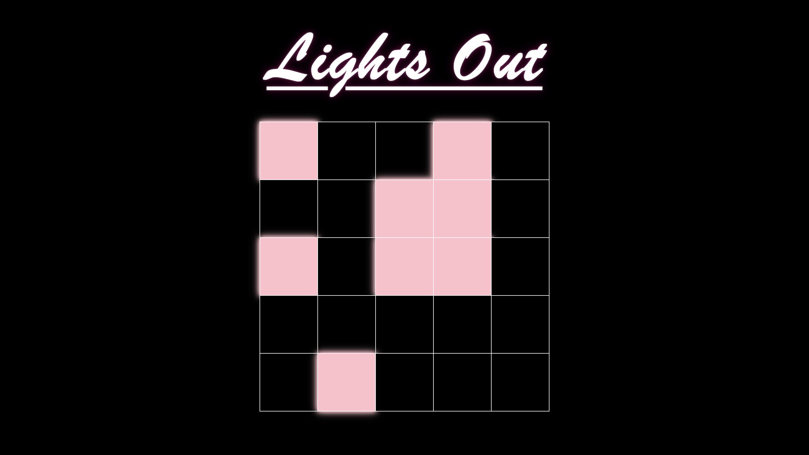

# Lights Out Game

## 🧐 Project Description

Lights Out is a logic/puzzle game that is played on a grid of individual lights, which can either be lit or unlit. The puzzle is won when when all of the lights are turned off. Created with React.js.

### **How to Play:**

- You can click on a cell to toggle that light — but it also toggles the light above it, to the left of it, to the right of it, and below it.

## 📝 Components

- App
  - Renders the Board component.
- Board
  - Holds the state that represents the in-memory grid of true/false for lights-on/off.
- Cell
  - Renders a table data element, where the CSS classes will indicate whether this cell is lit or unlit.
  - This is what the user clicks on — calls the function "flipCellsAroundMe" that is received from the Board to update the state in the Board component.
